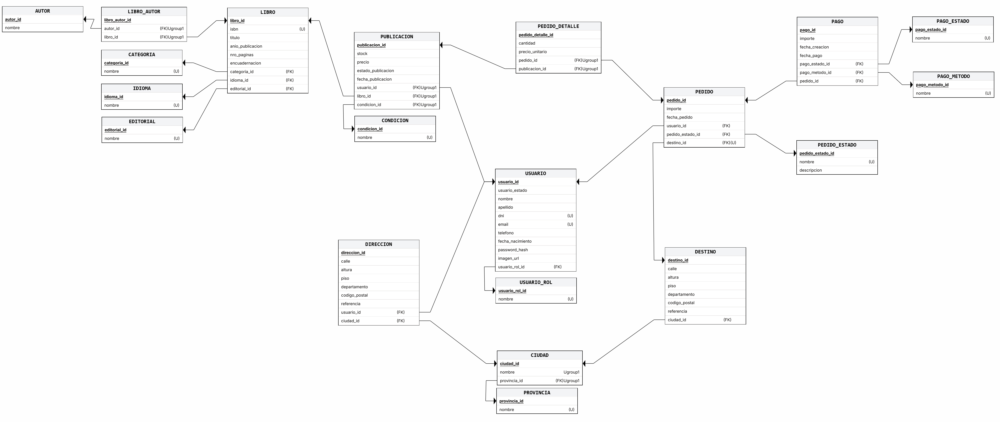

# Modelo relacional - Etapa II

Este documento describe el modelo relacional obtenido a partir del diagrama entidad-relación: cómo se transformó cada elemento del DER y qué estructura tiene cada tabla.

## 1. Resumen del modelo

El modelo está formado por 20 tablas. Siete son las principales del negocio: USUARIO, DIRECCION, AUTOR, LIBRO, PUBLICACION, PEDIDO y PAGO. Dos son intermedias y resuelven relaciones de muchos a muchos: LIBRO_AUTOR y PEDIDO_DETALLE. Dos describen la ubicación geográfica: PROVINCIA y CIUDAD. Las nueve restantes son catálogos: USUARIO_ROL, CATEGORIA, IDIOMA, EDITORIAL, ENCUADERNACION, CONDICION, PEDIDO_ESTADO, PAGO_ESTADO y PAGO_METODO.

La cantidad supera la referencia de 6 a 10 tablas. El ciclo de venta se sostiene con las tablas principales y las intermedias. Las otras once guardan valores que, de lo contrario, se repetirían como texto en cada registro. Son tablas pequeñas y de contenido estable, que no agregan pasos a la operación de venta.

Cada tabla tiene una clave primaria de una sola columna, llamada con el nombre de la tabla seguido de `_id`. Cada clave foránea conserva el nombre de la clave primaria a la que hace referencia. Por ejemplo, `libro_id` en PUBLICACION referencia a LIBRO.

## 2. Transformación del DER

Cada entidad del DER se transformó en una tabla con el mismo nombre, y sus atributos pasaron a ser columnas. Los identificadores se convirtieron en claves primarias y los atributos únicos conservaron esa restricción. Los atributos opcionales (O) dieron lugar a columnas no obligatorias.

Las 17 relaciones de uno a muchos se representaron con una clave foránea en la tabla del lado "muchos", que referencia a la tabla del lado "uno". En todas ellas la participación del lado "uno" es obligatoria (por ejemplo, todo pedido pertenece a un usuario), por lo que ninguna clave foránea admite valores vacíos.

Las dos relaciones de muchos a muchos se transformaron en tablas intermedias. La relación *escribe*, entre LIBRO y AUTOR, dio lugar a LIBRO_AUTOR. La relación *contiene*, entre PEDIDO y PUBLICACION, dio lugar a PEDIDO_DETALLE, que además incorpora los atributos propios de la relación: `cantidad` y `precio_unitario`. Cada tabla intermedia tiene su propia clave primaria, y la combinación de sus dos claves foráneas es única.

El atributo derivado `importe_total` de PEDIDO no se trasladó al modelo, ya que se obtiene a partir de PEDIDO_DETALLE. El DER no contiene relaciones de uno a uno.

## 3. Estructura de las tablas

Cada tabla se describe con las siguientes columnas:

- **Clave** indica si el atributo es clave primaria (PK) o clave foránea (FK).
- **Obligatorio** indica si el atributo debe tener valor.
- **Único** indica si el valor no puede repetirse. La marca (1) significa que lo que no puede repetirse es la combinación de los atributos marcados.
- **Referencia** indica la tabla a la que apunta cada clave foránea.

### 3.1 Catálogos

Ocho catálogos comparten la misma estructura: un identificador y un nombre que no puede repetirse. Son USUARIO_ROL, CATEGORIA, IDIOMA, EDITORIAL, ENCUADERNACION, CONDICION, PAGO_ESTADO y PAGO_METODO. En cada uno, el identificador toma el nombre de la tabla; por ejemplo, en CATEGORIA es `categoria_id`. PEDIDO_ESTADO también es un catálogo, pero se describe junto con los pedidos porque agrega una descripción.

| Atributo         | Clave | Obligatorio | Único | Referencia |
|------------------|-------|-------------|-------|------------|
| `<catalogo>_id`  | PK    | Sí          | Sí    |            |
| nombre           |       | Sí          | Sí    |            |

### 3.2 Usuarios y ubicación

USUARIO reúne a todos los actores del sistema y referencia su rol en USUARIO_ROL. Cada DIRECCION pertenece a un usuario y a una ciudad, y cada CIUDAD pertenece a una PROVINCIA. Dos ciudades pueden llamarse igual, pero no dentro de la misma provincia.

#### USUARIO

| Atributo         | Clave | Obligatorio | Único | Referencia  |
|------------------|-------|-------------|-------|-------------|
| usuario_id       | PK    | Sí          | Sí    |             |
| nombre           |       | Sí          |       |             |
| apellido         |       | Sí          |       |             |
| dni              |       | Sí          | Sí    |             |
| email            |       | Sí          | Sí    |             |
| telefono         |       | Sí          |       |             |
| fecha_nacimiento |       | Sí          |       |             |
| password_hash    |       | Sí          |       |             |
| imagen_url       |       | No          |       |             |
| es_activo        |       | Sí          |       |             |
| usuario_rol_id   | FK    | Sí          |       | USUARIO_ROL |

#### PROVINCIA

| Atributo     | Clave | Obligatorio | Único | Referencia |
|--------------|-------|-------------|-------|------------|
| provincia_id | PK    | Sí          | Sí    |            |
| nombre       |       | Sí          | Sí    |            |

#### CIUDAD

| Atributo     | Clave | Obligatorio | Único | Referencia |
|--------------|-------|-------------|-------|------------|
| ciudad_id    | PK    | Sí          | Sí    |            |
| nombre       |       | Sí          | (1)   |            |
| provincia_id | FK    | Sí          | (1)   | PROVINCIA  |

#### DIRECCION

| Atributo      | Clave | Obligatorio | Único | Referencia |
|---------------|-------|-------------|-------|------------|
| direccion_id  | PK    | Sí          | Sí    |            |
| calle         |       | Sí          |       |            |
| altura        |       | Sí          |       |            |
| piso          |       | No          |       |            |
| departamento  |       | No          |       |            |
| codigo_postal |       | Sí          |       |            |
| referencia    |       | No          |       |            |
| usuario_id    | FK    | Sí          |       | USUARIO    |
| ciudad_id     | FK    | Sí          |       | CIUDAD     |

### 3.3 Libros

LIBRO referencia a los catálogos CATEGORIA, IDIOMA, EDITORIAL y ENCUADERNACION, y su ISBN no puede repetirse. El vínculo con AUTOR se registra en LIBRO_AUTOR, donde cada fila asocia un libro con uno de sus autores sin repetir el mismo par.

#### AUTOR

| Atributo | Clave | Obligatorio | Único | Referencia |
|----------|-------|-------------|-------|------------|
| autor_id | PK    | Sí          | Sí    |            |
| nombre   |       | Sí          |       |            |

#### LIBRO

| Atributo          | Clave | Obligatorio | Único | Referencia     |
|-------------------|-------|-------------|-------|----------------|
| libro_id          | PK    | Sí          | Sí    |                |
| isbn              |       | Sí          | Sí    |                |
| titulo            |       | Sí          |       |                |
| anio_publicacion  |       | Sí          |       |                |
| nro_paginas       |       | Sí          |       |                |
| encuadernacion_id | FK    | Sí          |       | ENCUADERNACION |
| categoria_id      | FK    | Sí          |       | CATEGORIA      |
| idioma_id         | FK    | Sí          |       | IDIOMA         |
| editorial_id      | FK    | Sí          |       | EDITORIAL      |

#### LIBRO_AUTOR

| Atributo       | Clave | Obligatorio | Único | Referencia |
|----------------|-------|-------------|-------|------------|
| libro_autor_id | PK    | Sí          | Sí    |            |
| autor_id       | FK    | Sí          | (1)   | AUTOR      |
| libro_id       | FK    | Sí          | (1)   | LIBRO      |

### 3.4 Publicaciones

PUBLICACION vincula un libro con el usuario que lo ofrece y con la condición del ejemplar, registrada en CONDICION. La combinación de vendedor, libro y condición no puede repetirse.

#### PUBLICACION

| Atributo       | Clave | Obligatorio | Único | Referencia |
|----------------|-------|-------------|-------|------------|
| publicacion_id | PK    | Sí          | Sí    |            |
| stock          |       | Sí          |       |            |
| precio         |       | Sí          |       |            |
| es_activo      |       | Sí          |       |            |
| usuario_id     | FK    | Sí          | (1)   | USUARIO    |
| libro_id       | FK    | Sí          | (1)   | LIBRO      |
| condicion_id   | FK    | Sí          | (1)   | CONDICION  |

### 3.5 Pedidos

PEDIDO referencia al usuario que lo realiza, a su estado actual en PEDIDO_ESTADO y a la ciudad de envío. El resto de la dirección de envío se guarda en sus propios atributos. Cada renglón de PEDIDO_DETALLE asocia el pedido con una publicación, y una misma publicación no puede repetirse dentro de un pedido.

#### PEDIDO_ESTADO

| Atributo         | Clave | Obligatorio | Único | Referencia |
|------------------|-------|-------------|-------|------------|
| pedido_estado_id | PK    | Sí          | Sí    |            |
| nombre           |       | Sí          | Sí    |            |
| descripcion      |       | Sí          |       |            |

#### PEDIDO

| Atributo            | Clave | Obligatorio | Único | Referencia    |
|---------------------|-------|-------------|-------|---------------|
| pedido_id           | PK    | Sí          | Sí    |               |
| fecha_pedido        |       | Sí          |       |               |
| envio_calle         |       | Sí          |       |               |
| envio_altura        |       | Sí          |       |               |
| envio_piso          |       | No          |       |               |
| envio_departamento  |       | No          |       |               |
| envio_codigo_postal |       | Sí          |       |               |
| envio_referencia    |       | No          |       |               |
| usuario_id          | FK    | Sí          |       | USUARIO       |
| pedido_estado_id    | FK    | Sí          |       | PEDIDO_ESTADO |
| ciudad_id           | FK    | Sí          |       | CIUDAD        |

#### PEDIDO_DETALLE

| Atributo          | Clave | Obligatorio | Único | Referencia  |
|-------------------|-------|-------------|-------|-------------|
| pedido_detalle_id | PK    | Sí          | Sí    |             |
| cantidad          |       | Sí          |       |             |
| precio_unitario   |       | Sí          |       |             |
| pedido_id         | FK    | Sí          | (1)   | PEDIDO      |
| publicacion_id    | FK    | Sí          | (1)   | PUBLICACION |

### 3.6 Pagos

Cada PAGO pertenece a un pedido y referencia el método utilizado, registrado en PAGO_METODO, y su estado, registrado en PAGO_ESTADO. La fecha de pago es su único atributo no obligatorio.

#### PAGO

| Atributo       | Clave | Obligatorio | Único | Referencia  |
|----------------|-------|-------------|-------|-------------|
| pago_id        | PK    | Sí          | Sí    |             |
| importe        |       | Sí          |       |             |
| fecha_creacion |       | Sí          |       |             |
| fecha_pago     |       | No          |       |             |
| pago_estado_id | FK    | Sí          |       | PAGO_ESTADO |
| pago_metodo_id | FK    | Sí          |       | PAGO_METODO |
| pedido_id      | FK    | Sí          |       | PEDIDO      |

## 4. Restricciones no expresadas por el esquema

Algunas reglas del modelo no quedan garantizadas solo con las claves y las restricciones de unicidad. El usuario referenciado por PEDIDO debe tener el rol Cliente, y el referenciado por PUBLICACION, el rol Vendedor. Todo pedido debe tener al menos un renglón en PEDIDO_DETALLE y todo libro al menos un autor en LIBRO_AUTOR: la clave foránea asegura que cada fila de la tabla intermedia pertenezca a un pedido o a un libro, pero no que cada pedido o libro tenga filas asociadas. Por último, cada pedido puede tener como máximo un pago aprobado.
